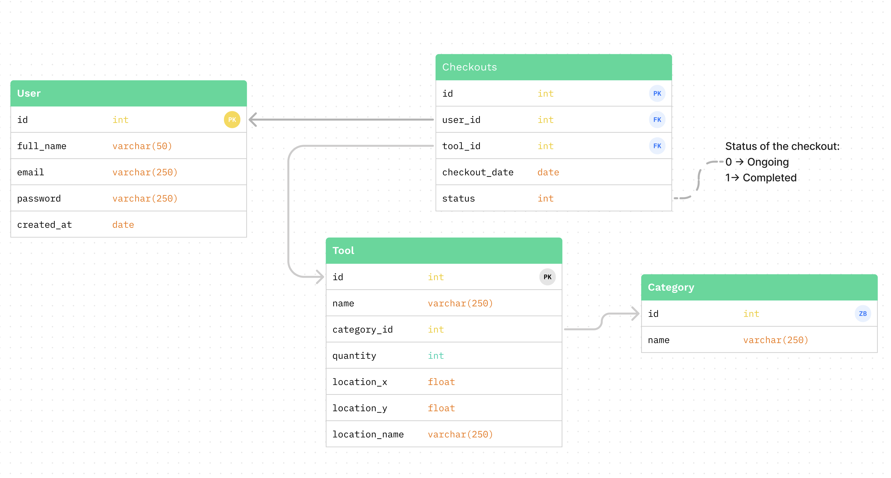

# Documentação do Banco de Dados

## Tabelas:

### 1. User

Esta tabela representa os usuários da plataforma.

| Campo       | Tipo       | Descrição                                                       |
|-------------|------------|-----------------------------------------------------------------|
| id          | int        | Identificador único do usuário.                                 |
| full_name   | varchar(50)| Nome completo do usuário.                                       |
| email       | varchar(250)| Endereço de e-mail do usuário.                                 |
| password    | varchar(250)| Senha criptografada do usuário.                                |
| created_at  | date       | Data de criação do registro do usuário.                         |

### 2. Tool

Esta tabela representa as ferramentas disponíveis.

| Campo         | Tipo        | Descrição                                                     |
|---------------|-------------|--------------------------------------------------------------|
| id            | int         | Identificador único da ferramenta.                            |
| name          | varchar(250)| Nome da ferramenta.                                           |
| category_id   | int         | Identificador da categoria à qual a ferramenta pertence.      |
| quantity      | int         | Quantidade disponível da ferramenta.                          |
| location_x    | float       | Coordenada X da localização da ferramenta.                    |
| location_y    | float       | Coordenada Y da localização da ferramenta.                    |
| location_name | varchar(250)| Nome do local onde a ferramenta está armazenada.             |

### 3. Checkouts

Esta tabela representa o registro de ferramentas que foram retiradas pelos usuários.

| Campo         | Tipo       | Descrição                                                      |
|---------------|------------|----------------------------------------------------------------|
| id            | int        | Identificador único do checkout.                               |
| user_id       | int        | Identificador do usuário que retirou a ferramenta.             |
| tool_id       | int        | Identificador da ferramenta retirada.                          |
| checkout_date | date       | Data em que a ferramenta foi retirada.                         |
| status        | int        | Status do checkout: 0 para Em Andamento, 1 para Concluído.     |

### 4. Category

Esta tabela representa as categorias das ferramentas.

| Campo | Tipo        | Descrição                                     |
|-------|-------------|-----------------------------------------------|
| id    | int         | Identificador único da categoria.             |
| name  | varchar(250)| Nome da categoria.                            |

---

## Relacionamentos:

1. **User <-> Checkouts**: Um usuario pode ter múltiplos checkouts, mas cada checkout está associado a um único usuário. Representado pela chave estrangeira `user_id` na tabela `Checkouts`.

2. **Tool <-> Checkouts**: Uma ferramenta pode ter múltiplos checkouts, mas cada checkout está associado a uma única ferramenta. Representado pela chave estrangeira `tool_id` na tabela `Checkouts`.

3. **Tool <-> Category**: Uma ferramenta pertence a uma única categoria, mas cada categoria pode ter múltiplas ferramentas. Representado pela chave estrangeira `category_id` na tabela `Tool`.
