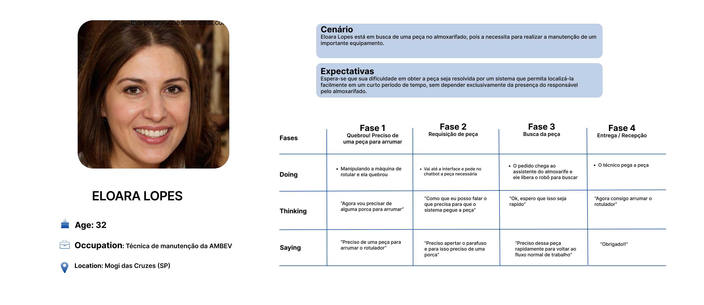

## Análise do fluxo da solução e mapeamento de pontos de fragilidade

Um mapa de jornada do usuário é uma ferramenta visual amplamente utilizada em UX design para representar a experiência de um usuário ao interagir com um produto, serviço ou sistema ao longo do tempo. Essa representação gráfica permite que as equipes compreendam as etapas, as emoções, os pontos de contato e as necessidades dos usuários durante sua jornada. O objetivo principal é fornecer uma visão holística da experiência do usuário, desde o primeiro contato até a conclusão de suas metas, ajudando a identificar oportunidades de aprimoramento do produto ou serviço. O mapa de jornada do usuário é uma ferramenta valiosa para otimizar a experiência do usuário, aumentar a satisfação do cliente e impulsionar o sucesso do negócio.

Dando continuidade à discussão, foi elaborada uma jornada do usuário para o sistema, na qual foi mapeado todo o ciclo que um operador percorrerá. Você pode visualizar essa jornada abaixo:

- **Fase 1:** Técnica percebe que precisa de uma peça do almoxarifado.
    - **Pontos de fragilidade:** O funcionário deve ser capaz de identificar qual é a peça que ele precisa. Condição visual deve possibilitar a identificação da peça. Além disso, deve ter condição física dos membros superiores favorável à manipulação do equipamento e identificar o que ele precisa.

- **Fase 2:** Técnica faz a requisição da peça.
    - **Pontos de fragilidade:** O funcionário não vai conseguir utilizar a ferramenta speech-to-text se ele tiver problemas de comunicação/fala, haja vista a necessidade de interpretação de sua fala. Haja vista a interação com um computador para realizar a requisição, o técnica pode apresentar dificuldades com a tecnologia ou possíveis receios relacionados ao manuseio do computador. Essas dificuldades podem se relacionar à familiaridade com o sistema e a inacessibilidade visual (ícones muito pequenos, por exemplo)

- **Fase 3:** Técnica vai até o almoxarifado retirar a peça.
    - **Pontos de fragilidade:** O funcionário pode apresentar limitações físicas ao retirar e carregar a peça.

- **Fase 4:** Realiza a instalação da peça no equipamento necessário.
    - **Pontos de fragilidade:** Nenhum ponto identificado, uma vez que deixa de haver interação com a solução proposta.

