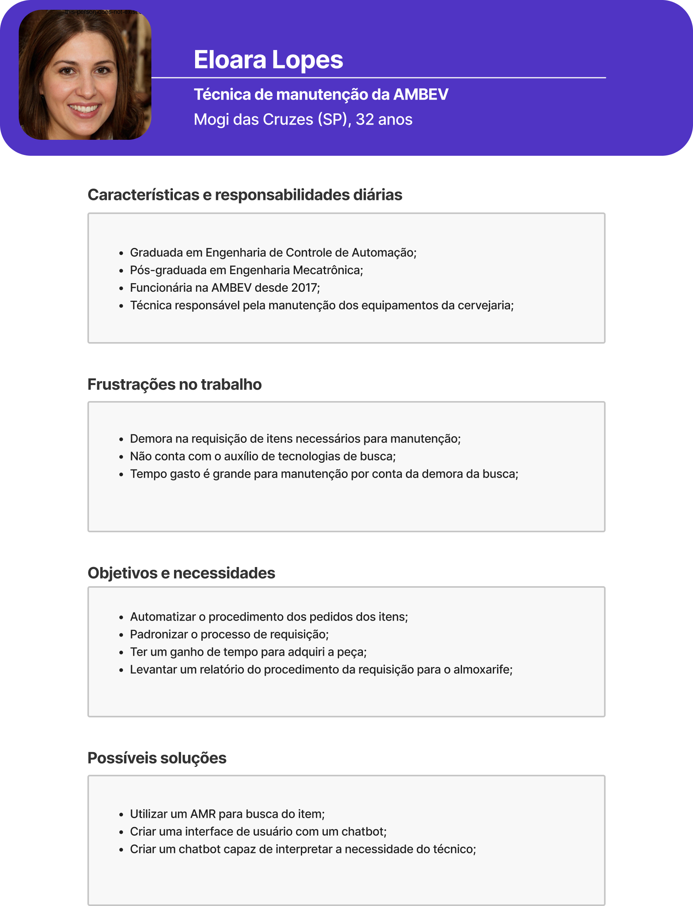
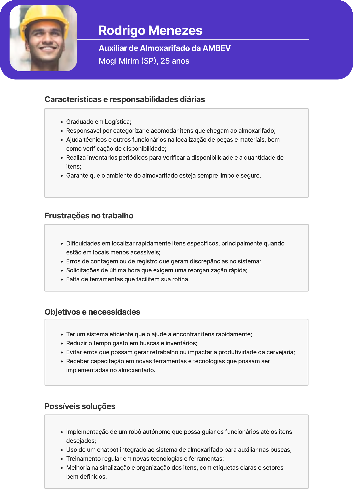

# Personas

Personas são retratos fictícios de indivíduos reais, construídos a partir de dados e informações adquiridas através de entrevistas com os stakeholders e pesquisas relacionadas à área de interesse. O propósito das personas é auxiliar a equipe do projeto na aprofundada compreensão das metas, obstáculos e padrões de comportamento dos usuários finais do produto ou serviço. Isso, por sua vez, possibilita o desenvolvimento de soluções mais adequadas e personalizadas, direcionadas para atender às necessidades específicas dos usuários.

No caso desse projeto, as personas Eloara Lopes e Rodrigo Menezes foram criadas a partir de informações obtidas em entrevistas com um responsável do almoxarifado e um estagiário da Ambev, bem como pesquisas sobre a indústria e normas de segurança. Essas informações foram usadas para criar um perfil detalhado de cada persona, incluindo suas características demográficas, habilidades, experiências, desafios e objetivos.

<!-- -->

Ao criar essas personas, a equipe do projeto pode visualizar como o robô StellaBot pode ser útil para Eloara Lopes, por exemplo, permitindo que ela faça requisições de itens ao alomxarifado com mais rapidez e segurança. Já para Rodrigo Menezes, o robô pode ajudá-lo a gerenciar melhor a segurança no almoxarifado, permitindo que ele pegue as peças requisitadas de forma organizada e assertiva para os técnicos.