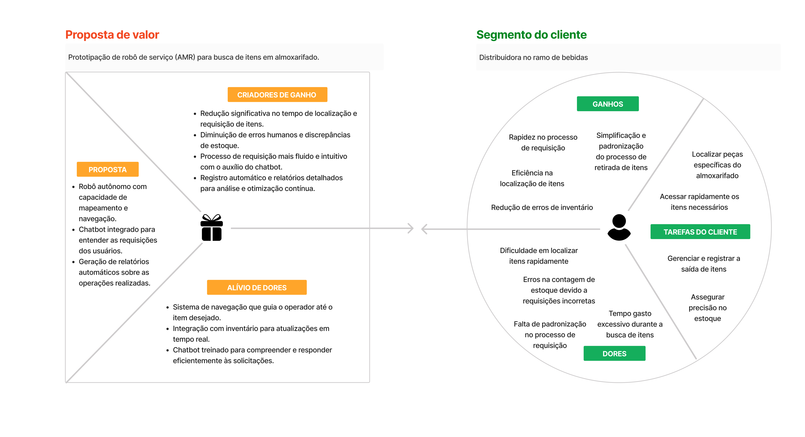

# Canvas Proposta de Valor

## **Proposta de Valor**
A proposta é focada na prototipação de um robô de serviço (AMR) para busca de itens em um almoxarifado.

### **Características Principais**

1. **Robô Autônomo:** Equipado com tecnologias de mapeamento e navegação avançadas, o robô é capaz de se deslocar autonomamente por ambientes diversos.
2. **Chatbot Integrado:** Uma interface amigável para compreender e atender às requisições dos usuários.
3. **Geração de Relatórios Automáticos:** O sistema pode gerar relatórios detalhados sobre as operações realizadas, proporcionando insights e oportunidades de otimização.
4. **Sistema de Navegação:** Guiando o operador até o item desejado, tornando o processo de localização mais eficiente.
5. **Integração com Inventário:** Atualizações em tempo real garantem que o inventário esteja sempre atualizado e preciso.
6. **Chatbot Otimizado:** Treinado para responder eficientemente às solicitações, tornando o processo de requisição mais fluido e intuitivo.

### **Criadores de Ganho**

1. **Redução no Tempo:** A localização e requisição de itens tornam-se significativamente mais rápidas.
2. **Minimização de Erros:** Reduz erros humanos e discrepâncias de estoque.
3. **Requisição Intuitiva:** O processo de requisição se torna mais fluido com a ajuda do chatbot.
4. **Análise e Otimização:** Relatórios detalhados para uma análise profunda e otimização contínua.

### **Alívio de Dores**

1. **Guia de Navegação:** Ajuda o operador a localizar o item desejado.
2. **Atualizações em Tempo Real:** O inventário permanece atual e preciso.
3. **Chatbot Eficiente:** Responde eficientemente às solicitações, otimizando o processo de requisição.

## **Segmento do Cliente**
O cliente caracteriza-se por uma distribuidora no ramo de bebidas.

### **Ganhos para o Cliente**

1. **Rapidez:** No processo de requisição.
2. **Eficiência:** Na localização de itens.
3. **Redução:** De erros de inventário.
4. **Simplificação:** Padronização do processo de retirada de itens.
5. **Acesso Rápido:** A itens necessários do almoxarifado.
   
### **Tarefas do Cliente**

1. **Gerenciamento:** Registro da saída de itens.
2. **Precisão:** Garantir precisão no estoque.
3. **Tempo:** Reduzir o tempo gasto durante a busca de itens.

### **Dores do Cliente**

1. **Dificuldade:** Em localizar itens rapidamente.
2. **Erros de Estoque:** Devido a requisições incorretas.
3. **Falta de Padronização:** No processo de requisição.