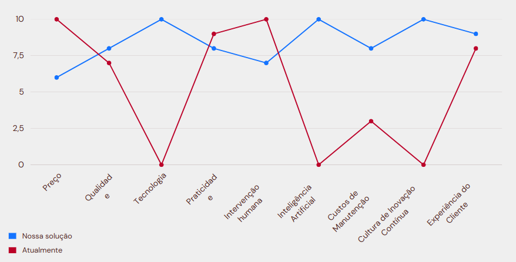

# Matriz Oceano Azul

A matriz Oceano Azul é uma ferramenta de estratégia de negócios que visa criar novos espaços de mercado, livres da concorrência direta, ao invés de competir em mercados existentes. Ela se concentra em identificar e explorar oportunidades de mercado não atendidas, redefinindo as regras do jogo e criando novas demandas. Isso é feito por meio da análise de diferentes atributos que podem diferenciar um produto ou serviço no mercado.

No contexto do projeto, a análise da matriz Oceano Azul ajuda a identificar nove atributos importantes para os clientes e que diferenciarão seu produto da concorrência por meio das ações de "Reduzir, Eliminar, Aumentar e Criar". Cada atributo é avaliado em relação ao projeto proposto em comparação com o modelo atual. 

Buscamos identificar nove atributos que são importantes para os clientes e que diferenciarão seu produto da concorrência por meio das ações de Reduzir, Eliminar, Aumentar e Criar. Segue abaixo, os nove atributos identificados com essas ações:

Aqui está uma breve descrição da análise realizada:

1. **Preço (Aumentar)**: Nosso produto não apresenta um preço mais baixo em comparação com o modelo atual.

2. **Qualidade (Aumentar)**: Com a implementação do nosso produto haverá uma diminuição no tempo de espera no almoxerifado e um melhor aproveitamento do tempo por parte dos funcionários, aumento a qualidade, o que é fundamental para a satisfação do cliente.

3. **Tecnologia (Aumentar)**: Nosso produto possui tecnologias avançadas, o que fará com que os usuários possam utilizar novas features para a localização dos produtos o que é um grande diferencial em relação a como eles fazem atualmente por um processo todo manual e apenas um app para solicitação.

4. **Praticidade (Manter)**: A praticidade é mantida, o que significa que nosso produto será tão fácil de usar quanto o processo realizado atualmente.

5. **Intervenção humana (Reduzir)**: Nossa solução reduz a necessidade de intervenção humana em comparação com os métodos atuais.

6. **Inteligência Artificial (Aumentar)**: Incorporamos inteligência artificial ao  produto, proporcionando um nível de automação que o modelo atual não possui.

7. **Custos de Manutenção (Manter)**: Os custos de manutenção do nosso produto é mais elevado em comparação com o modelo atual .

8. **Cultura de Inovação Contínua (Aumentar)**: Com a implementação do robô no âmbiente de almoxerifado haverá um aumento a da inovação na AMBEV.

9. **Experiência do Cliente (Criar)**: Além dos atributos listados, você poderemo criar uma experiência melhor ao cliente, como um atendimento personalizado ou um suporte técnico ágil.

Essas ações ajudam a destacar os atributos nos quais nosso produto se diferencia da concorrência, seja reduzindo desvantagens, eliminando ineficiências, aumentando funcionalidades importantes ou criando novos benefícios para os clientes. Isso deve ajudar a direcionar os esforços de marketing e desenvolvimento de produto.

