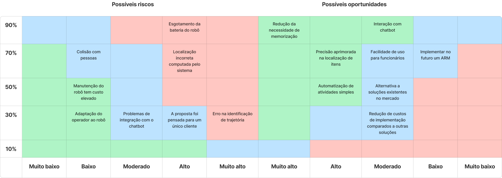

# Matriz de Riscos

A matriz de riscos é primordial para elencar os pontos que merecem mais atenção no projeto e sua probabilidade de acontecer. 
Assim, riscos e oportunidades são apresentados na imagem abaixo.

## Riscos
Nesta etapa, será elencado em mais detalhes os pontos de risco que estão na matriz.

1. **Erro na identificação de trajetória**

    - O robô tem dificuldade em seguir a rota mais eficiente para a coordenada onde está produto.
     
2. **Localização incorreta computada pelo sistema**

    - Risco de divergência entre a localização registrada no sistema de ERP e a posição real do produto no almoxarifado.
     
3. **Esgotamento da bateria do robô**

    - A bateria do robô pode acabar durante o expediente, o que prejudicaria todo o funcionamento da solução
     
4. **Colisão com pessoas**

    - Dado o tamanho do robô é possível que as pessoas não vejam o mesmo e tropecem nele. Além disso, o robô não tem visão computacional e ele pode colidir com pessoas ou objetos.
     
5. **Adaptação do operador ao robô**

    - O usuário que irá utilizar o robô, pode não conseguir utilizar corretamente os sistemas de speech to text e assim impossibilitando o funcionamento correto do mesmo.
     
6. **Problemas de integração com o chatbot**

    - Ao desenvolver a solução sempre é possível ter o perigo de não conseguir realizar as conexões corretas para um funcionamento 100% .
      
7. **A proposta não se adequa a outros setores do mercado**

    - A proposta apresenta uma solução específica dentro de um contexto amplo. Nossa solução visa proporcionar autonomia no processo de localização de peças, embora algumas empresas possam adotar uma abordagem tradicional, preferindo designar um responsável pelo manuseio e acesso ao almoxarifado.
   
8. **A manutenção do robô ter um custo elevado**

    - Devido à natureza de ser uma solução em escala industrial, o robô final será mais robusto e necessitará de manuseio delicado e inspeções regulares para preservar a sua integridade. Considerando esses aspectos, a manutenção pode ser onerosa.

## Oportunidades
Nesta etapa, será elencado em maior profundidade as oportunidades que o projeto oferece. 

1. **Automatização de atividades simples**
    - Ao automatizar o processo de localizar as peças o almoxarife consegue aumentar sua produtividade. Assim é possível focar em tarefas mais complexas e estratégicas.

2. **Precisão aprimorada na localização de itens**
    - Como o sistema é integrado com ERP o robô encontra facilmente os itens que foram requisitados. Aumentando a eficiência operacional.

3. **Facilidade de uso para funcionários**
    - Um sistema onde só é necessário fazer uma requisição de peças por voz a experiência é mais intuitiva e rápida.

4. **Redução da necessidade de memorização**
    - Como o robô tem acesso aos dados onde estão as peças, o assistente de almoxarifado não precisa lembrar onde está cada item.
  
5. **Redução de custos de implementação comparados a outras soluções**
    - Por ser uma solução interna o custo de implantação é menor e a capacidade de atender regras de negócio específicas.

6. **Implementar no futuro um ARM**
    - Com a prova de conceito do robô bem sucedida. É possível implementar um ARM, no qual o técnico de manutenção possa fazer uma requisição na linha de produção e em poucos instantes o robô traz o item que foi requisitado. Assim, a eficiência operacional é elevada e o processo é automatizado.

7. **Alternativa às soluções tradicionais do mercado**
    - O mercado de robôs autônomos é vasto, com disponibilidade de soluções prontas e, em alguns casos, opções personalizadas. Nossa solução oferece um custo significativamente mais baixo, uma vez que é projetada considerando o espaço e as necessidades específicas do almoxarifado. Além disso, é importante notar que grande parte da manutenção poderá ser realizada pelos técnicos da própria empresa.

8. **Interação com chatbot**
    - Em comparação com outras propostas de mercado, que em maioria se limitam a permitir que o operador envie comandos por meio de botões, nossa solução oferece uma interação única com o usuário, isso é feito via comandos de voz. Ela tem o potencial de transformar uma função mecânica, antes repetitiva e carente de interatividade, em algo mais humano, permitindo uma comunicação direta entre o operador e a máquina. Isso resulta em uma vantagem competitiva significativa em relação a propostas semelhantes.
