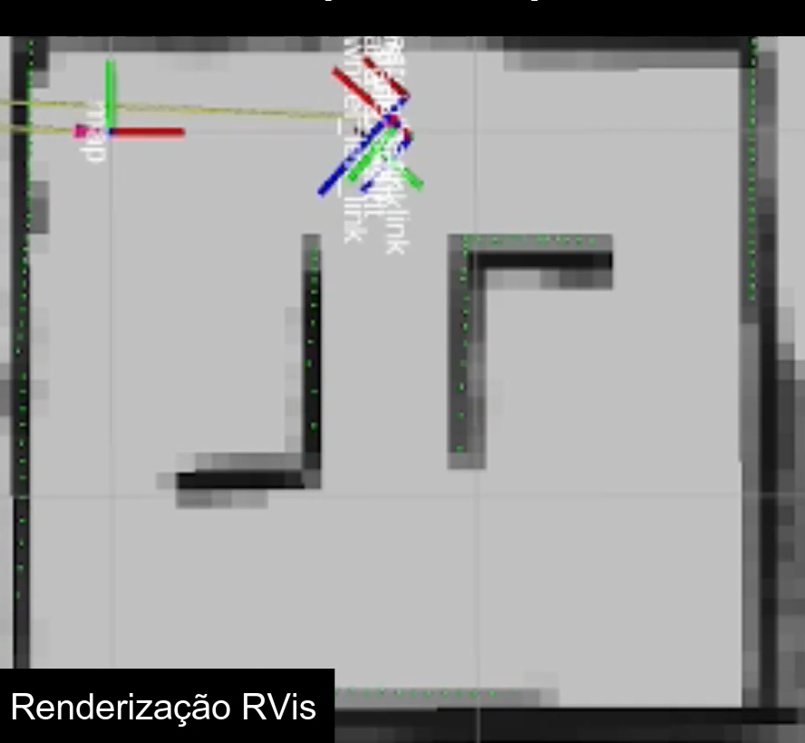

# Mapeamento do ambiente 

#### Introdução
Saber onde se está é uma necessidade essencial do ser humano e primordial para um robô que visa buscar peças. Assim, para o TurtleBot 3 é utilizado o sistema de mapeamento Nav2 (Navigator 2) que recebe as informações da camera infravermelho . 
Assim, a camera do robô fica girando constantemente e emitindo um feixe infravermelho que retorna ao sensor e assim é possível formar uma imagem em 360º do ambiente. 

#### Mapeamento 

Para o robô entender onde o mesmo está localizado e realizar a navegação até determinado ponto do mapa são necessários alguns passos. Considerando que as configurações do robô já estejam prontas, isto é com sistema operacional instalado, conectado a internet e com as bibliotecas instaladas. 
Assim, para mapear o ambiente, é utilizano o software gazebo, de tal modo que é possível movimentar o robô por toda a área a ser mapeada. O resultado deste mapeamento pode ser observado na imagem abaixo. 



Após o mapa do ambiente estar salvo é possível definir diferentes pontos no mapa e o robô pode navegar até esses pontos como no vídeo abaixo. 

<iframe width="560" height="315" src="https://www.youtube.com/embed/raEjiScBLww?si=LWchqNsOgfs0wcSm" title="YouTube video player" frameborder="0" allow="accelerometer; autoplay; clipboard-write; encrypted-media; gyroscope; picture-in-picture; web-share" allowfullscreen></iframe>

#### Métodos 
Caso deseje realizar o mesmo processo é necessário realizar alguns passos que serão elencados a seguir.
Primordiamente é necessário ter algum ambiente linux, no caso do desenvolvimento do robô, carinhosamento apelidado de Beer Bringer foi utilizado a distro Ubuntu 22.04. Então, provavelmente    

##### 1 Para a etapa de mapeamento do ambiente, foi realizada uma simulação no Gazebo.

**O primeiro passo é baixar o ROS**

No terminal execute os seguintes comando
```
sudo apt install ros-humble-navigation2 ros-humble-nav2-bringup ros-humble-turtlebot3*
```
e logo em seguida 
```
sudo apt install ros-humble-rmw-cyclonedds-cpp
```

por fim 

```
echo "export RMW_IMPLEMENTATION=rmw_cyclonedds_cpp" >> ~/.bashrc
```

Após o ambiente configurado nós já conseguimos se conectar ao robô e iniciar o mapeamento com o gazebo. 

No terminal execute os seguintes comandos. Cada um desses deve ser feito em uma nova aba do terminal. 

O comando abaixo inicia o gazebo que é a ferramenta para mapear e visualizar o robô
```
ros2 launch turtlebot3_gazebo turtlebot3_world.launch.py
```
Permite controlar o robô com o teclado .
```
ros2 run turtlebot3_teleop teleop_keyboard
```
Este comando abre o Rviz, um software essencial para visualizar as informações que o sensor do robô coleta .

```
ros2 launch turtlebot3_cartographer cartographer.launch.py use_sim_time:=True 
```


##### 2 Mapeando o ambiente 

Nesta etapa o objetivo é mapear o local onde o robô será utilizado e logo em seguida salvar o arquivo para usos futuros. 


