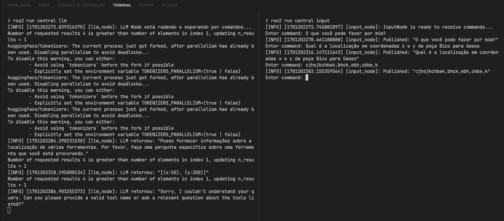

# Descrição de Testes (LLM)

Um dos requisitos da sprint foi a testagem do chatbot construído, uma vez que um Large Language Model (LLM) foi implementado para compor a solução. Embora a integração entre o chatbot e o sistema de navegação do robô esteja prevista para a quarta sprint, é possível testar as funcionalidades do chatbot de forma isolada, a fim de verificar a eficácia do modelo de linguagem adotado pela equipe de projeto.

Até o momento, é possível realizar as validações descritas abaixo:

- O LLM é capaz de fornecer respostas que correspondam ao contexto passado para o modelo;
- O LLM é capaz de fornecer respostas baseadas no arquivo de texto utilizado para seu treinamento;
- O LLM é capaz de retornar uma mensagem de erro caso não tenha conseguido interpretar a solicitação do usuário.
- O LLM é capaz de retornar, ao usuário, as coordenadas de um item solicitado, contanto que o item esteja presente no arquivo de texto utilizado para seu treinamento;

O primeiro passo para realizar as validações mencionadas é a execução dos pacotes correspondentes ao script de input do usuário e ao LLM. Os comandos do usuário podem ser enviados de duas maneiras distintas: pelo terminal ou pelo chatbot que roda na interface do Telegram. Isto é, é possível interagir com o modelo de linguagem por meio de dois diferentes pacotes do nodo central do nosso workspace ROS: o pacote <code>input</code> e o pacote <code>telegram</code>. Enquanto o Telegram configura a interface escolhida para o chatbot, permitindo uma interação fluida com o usuário, o pacote de input representa uma interface mais simples, via terminal, ideal para realizarmos as validações e testes necessários. Desse modo, a fim de concretizar os testes, foi necessário executar o pacote <code>input</code> paralelamente ao pacote <code>llm</code>. Para isso, os seguintes procedimentos foram realizados:

**1.** Abrir o workspace ROS no terminal

```bash
cd grupo2/src/workspace
```

**2.** Construir os pacotes localmente

```bash
colcon build
```

**3.** Executar o comando de setup local

```bash
source install/local_setup.zsh
```

**4.** Executar o pacote <code>input</code>, para enviar os comandos ao LLM

```bash
ros2 run central input
```

**5.** Executar o pacote <code>llm</code>, para receber os comandos e retornar as respostas do modelo

```bash
ros2 run central llm
```

Ao executar o pacote <code>input</code>, a seguinte mensagem é exibida:

```bash
[INFO] [1701188278.143934045] [input_node]: InputNode is ready to receive commands...
Enter command:
```

Ao executar o pacote <code>llm</code>, em um terminal distinto, a seguinte mensagem é exibida:

```bash
[INFO] [1701174969.932322949] [llm_node]: LLM Node está rodando e esperando por comandos...
```

O pacote de input de usuário é estruturado como um publicador de mensagens para o LLM, que está subscrito ao tópico responsável por estabelecer uma ponte de comunicação entre os dois pacotes. Ao enviarmos um comando por meio do primeiro terminal, como *"O que você pode fazer por mim?"*, o segundo terminal exibe:


```bash
[INFO] [1701188359.231260460] [llm_node]: LLM recebeu: "Olá! O que você pode fazer por mim?"
```

Uma vez que o modelo escolhido utiliza Ollama, torna-se necessário esperar por um determinado período de tempo para receber uma resposta. Abaixo está um exemplo de resposta que o nó retorna:

```bash
[INFO] [1701188359.231260460] [llm_node]: LLM retornou: "Posso fornecer informações sobre a localização de várias ferramentas. Por favor, faça uma pergunta específica sobre uma ferramenta que você está procurando"
```

## Realização de Testes:

Para a realização do teste do LLM de acordo com o contexto do arquivo `data.txt` dentro da pasta `src/workspace/src/central/resource` passado para o treinamento do modelo, a seguinte pergunta foi feita no nó de input:

```bash
Enter command: Qual é a localização em coordenadas x e y da peça Bico para Gases
[INFO] [1701202278.661188888] [input_node]: Published: "Qual é a localização em coordenadas x e y da peça Bico para Gases"
```
Resposta:

```bash
[INFO] [1701188359.231260460] [llm_node]: LLM retornou: "[(x:50),(y:200)]"
```

Caso haja algum erro na requisição, ou o LLM não consiga interpretar o pedido, a seguinte resposta será retornada:

```bash
[INFO] [1701188359.231260460] [llm_node]: LLM retornou: "Sorry, I couldn't understand your question. Can you please provide a valid tool name or ask a relvant question about the tools listed?"
```

Abaixo, é possível ver os testes descritos acima realizados com a ativação dos nós de input e llm pelo terminal:


