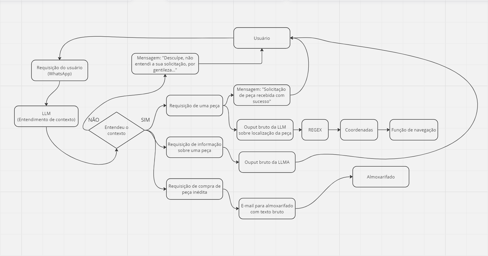

# Fluxo do chatbot

No diagrama de estados abaixo é possível observar o fluxo das intereações pretendidas para a interface Telegram com o chatbot.

A interação deve começar com o usuário enviando uma requisição no chat Telegram do chatbot. No momento do envio da requisição, seu conteúdo de texto será analisado por um Large Langague Model (LLM) contextualizado com informações pertinentes referentes as peças presentes no almoxarifado, vindas de um documento texto, bem como um prompt customizado. Dentre essas informações estarão o nome da peça, seu código, quantidade e coordenadas para localização no almoxarifado. Caso a instrução seja inteligível, o script devolverá para a interface Telegram de chat com usuário a mensagem "Desculpe, não entendi o que você quis dizer, por favor, faça sua pergunta novamente usando outras palavras." A escolha da linguagem coloquial para as respostas do chatbot se justifica em oferecer uma maior acessibilidade de compreensão a quem estiver a cargo da interação.

Caso reformulação do soliticação, ou até mesmo a primeira delas, for compreendida pelo LLM, esta será curada em três categorias. Essas categorias são: Requisição de uma peça, Requisição de informação sobre uma peça e Requisição de compra de peça inédita.

Caso a solicitação seja entendida pelo LLM como Requisição de uma peça, o script retornará a mensagem "Solicitação da peça recebida com sucesso" para a interface do chat enquanto o retorno de texto da LLM contextualizada sobre as informações requeridas é enviado para um script de regex configurado para a obtenção das coordenadas x, y do item requisitado. Essas coordenadas, por sua vez, são enviadas para a função de navegação do robô, que o guiará até tais coordenadas, evitando obstáculos no caminho.

Na ocasião da solicitação feita pelo usuário do chatbot ser entendida pelo LLM como uma requisição de informação sobre uma peça específica, o output bruto de texto que o modelo gerará será retornado ao usuário pela interface do chatbot.

Por fim, se a requisição original do usuário for identificada como a de uma compra de peça inédita, um template d etexto de e-mail será preenchido automaticamente com as informações da peça, quantidade, bem como o nome e departamento do solicitante e enviado para o almoxarifado, que será resposável por sua aquisição.

É válido ressaltar que nem todas as interações descritas estão operacionais na atual sprint. Este diagrama deve ser interpretado como um planejamento a curto prazo do comportamento ideal da interface com o chatbot desenvolvida.
