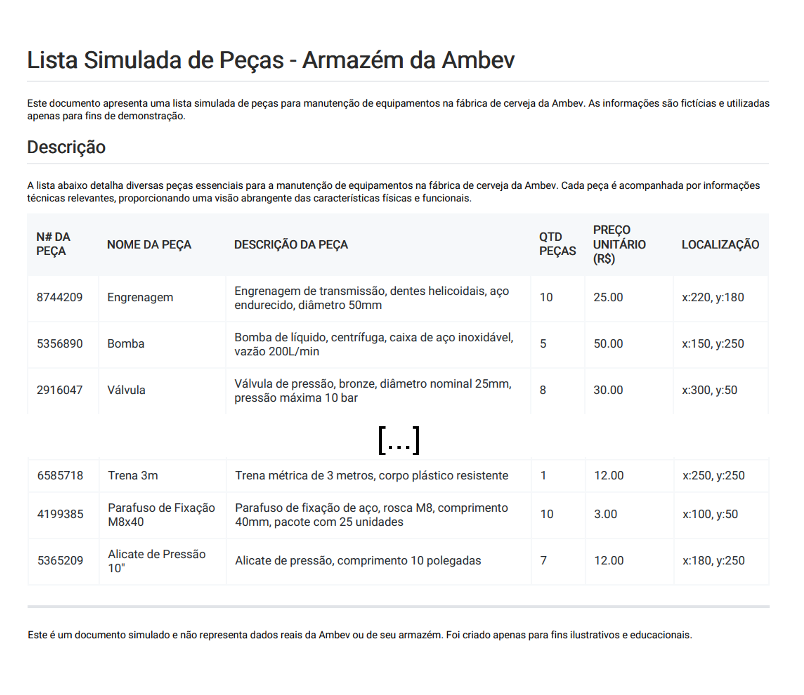
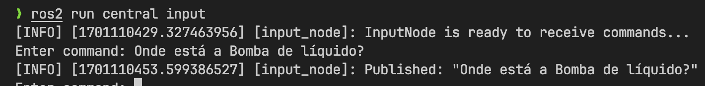
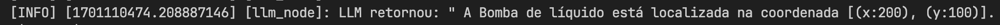

# Large Language Model

## Visão Geral

Essa seção fornece detalhes sobre o `LlmNode`, um componente do sistema ROS. Ele utiliza modelos de linguagem grande (LLMs) para processar e responder a consultas de texto, especialmente aquelas recebidas via Telegram, e encaminha as informações para outro nó ROS que utiliza expressões regulares (regex) para determinar ações subsequentes.

## Bibliotecas utilizadas

- **ROS (Robot Operating System):** Um middleware para robótica que oferece serviços padrões como abstração de hardware, controle de dispositivos de baixo nível, implementação de funcionalidade comumente usada, passagem de mensagens entre processos, e gerenciamento de pacotes.
- **Python 3.x:** A linguagem de programação usada para desenvolver o nó LLM.
- **rclpy:** Fornece a API do ROS para Python, permitindo a criação de nós ROS e a comunicação entre eles.
- **ament_index_python:** Utilizado para encontrar pacotes, recursos e compartilhamentos no ambiente ROS, facilitando o gerenciamento de recursos e dependências.
- **langchain:** Uma biblioteca que facilita a integração de modelos de linguagem grande com outras aplicações. Esta biblioteca é crucial para incorporar a capacidade de processar e entender linguagem natural de forma avançada.

### Utilidade das Bibliotecas

- `rclpy` é o núcleo da interação com o ROS, facilitando a comunicação entre diferentes nós e a implementação de callbacks e publishers/subscribers.
- `ament_index_python` ajuda na localização de arquivos e recursos dentro do ambiente ROS, o que é crucial para acessar arquivos de configuração e dados.
- `langchain` é usada para integrar o modelo de linguagem grande (LLM), que é essencial para entender e processar as entradas de texto de uma maneira sofisticada e contextualizada.

## O Papel do Modelo de Linguagem Grande (LLM)

O LLM é usado para interpretar as entradas de texto recebidas, principalmente do Telegram. Diferente de métodos mais simples, o LLM pode entender nuances e a intenção completa das consultas do usuário, oferecendo respostas mais precisas e contextuais.

## Implementação do Nó LLM

### Classe `LlmNode`

```python
class LlmNode(Node):
    def __init__(self, base_url, model_name, data_file_path):
        ...
        # Processamento de contexto
        ...

    def run_ollama(self, text):
        ...
        # Lógica para gerar respostas com base no contexto
        ...

    def listener_callback(self, msg):
        ...
        # Callback para mensagens recebidas
        ...

```

#### Inicialização (`__init__`)

No método `__init__`, o nó é inicializado, carregando o contexto de um arquivo de texto. Este contexto é processado e transformado em embeddings através de `SentenceTransformerEmbeddings`, que converte o texto em representações numéricas entendíveis pelo LLM.

#### Processamento de Contexto

Aqui, detalhamos como o nó carrega e processa o contexto. O texto é dividido em segmentos utilizando `CharacterTextSplitter`, e cada segmento é transformado em embeddings. Estes embeddings são armazenados em um `vectorstore` (neste caso, `Chroma`), que facilita a recuperação e o uso dessas informações pelo LLM.

#### Geração de Respostas (`run_ollama`)

Este método utiliza o LLM para processar as entradas de texto e gerar respostas. O LLM analisa a entrada e, utilizando o contexto armazenado, gera uma resposta que é passada para outros nós ROS.

#### Callback de Mensagens (`listener_callback`)

Este método lida com as mensagens recebidas (neste caso, do Telegram) e inicia o processamento do LLM, passando a entrada de texto para `run_ollama`.

### Código de Inicialização e Execução (`main`)

Essa função inicia o nó e o coloca em operação dentro do ambiente ROS.

## Interação com Telegram e Outros Nós ROS

O `LlmNode` recebe mensagens do Telegram, processa-as com o LLM e, em seguida, as envia para outros nós ROS. Estes nós usam regex para analisar a saída do LLM, identificar a intenção do usuário e determinar ações correspondentes.

## Contexto da LLM e Formato de Dados

O Large Language Model utilizado no projeto deve ser capaz de fornecer informações sobre os itens disponíveis no almoxarifado da Ambev que são de natureza confidencial e volátil. Para isso, o LLM foi desenvolvido de tal modo que possa receber informações sobre os itens a partir de um documento e, a partir deste, ser capaz de extrair as informações necessárias do documento oferecido mediante requisições do usuário na interface com o chatbot.

Inicialmente, um documento estruturado de forma a se assemelhar a um documento oficial de balanço de um almoxarifado de uma cervejaria foi gerado com o auxílio do serviço Chat GPT (OpenAI, Inc), que é baseado no LLM GPT-4, bem como com a edição de seu conteúdo em formato markdown e sua posterior conversão para o formato PDF. Abaixo, é possível conferir o formato que o arquivo assumiu:



Dado que as tentativas de realizar a contextualização do LLM utilzando o conteúdo do arquivo PDF não gerou resultados assertivos, foi adotada uma estratégia de contextualização utilizando um arquivo txt com informações mais explícitas sobre a localização da peça do que o conteúdo que estava sendo obtido do PDF.

Abaixo está um exemplo do padrão utilizado para transmissão das informações de localizaçõa de cada peça:

```txt
Engrenagem: [(x:220), (y:180)],
Bomba de líquido: [(x:150), (y:250)],
...
```

### Comprovação de Funcionamento do Contexto

Para comprovar o funcionamento do contexto, foi feita uma consulta ao LLM perguntando a localização de uma peça. Segue a mensagem e o output retornado pelo LLM:

#### Entrada



#### Saída


