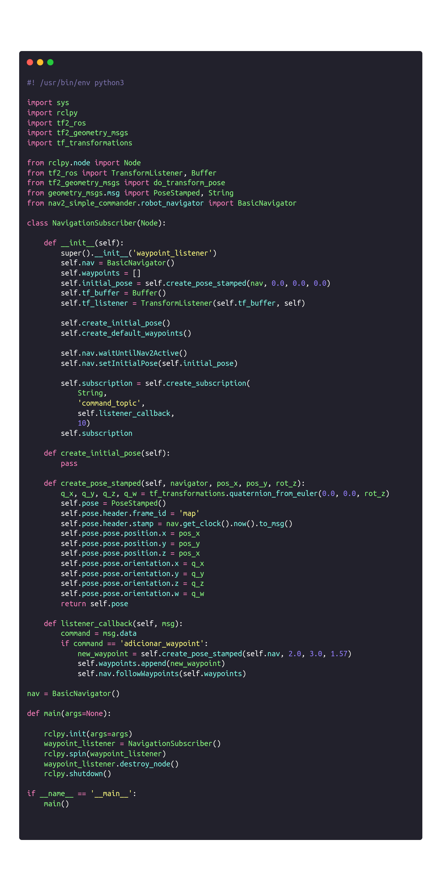

# Sistema de navegação

Na segunda sprint do projeto, o grupo concretizou o mapeamento do circuito físico construído para simular o almoxarifado da Ambev. Além disso, foi possível fazer o robô se movimentar de forma autônoma através de um script simples de navegação, que definia uma série de waypoints para o Turtlebot percorrer. No entanto, a terceira sprint foi marcada pela implementação de um sistema de navegação mais robusto, cuja estrutura de código se caracteriza pela implementação do sistema publisher-subscriber.

### Estrutura de código

O nodo de navegação pode ser representado, majoritariamente, pelo subscriber desenvolvido: <code>navigation_subscriber.py</code>. O objetivo do script é subscrever-se a um tópico que envia as coordenadas para as quais o Turtlebot deve se movimentar. A ideia é que o tópico seja pertencente ao nodo central da solução, uma vez que depende da intenção do usuário quando esta corresponde ao objetivo de localizar uma peça no almoxarifado. Dessa forma, embora o nodo central da solução não esteja integrado ao nodo de navegação, a estrutura de código foi preparada para a estratégia de subscrição descrita.

O código utilizado para o desenvolvimento do subscriber é apresentado abaixo.

Primeiramente, são importados os módulos do ROS, Python e Navigation2 necessários para que o script funcione da maneira correta. A classe <code>NavigationSubscriber</code> é criada como um nó do ROS, sendo que o método <code>__init__</code> é responsável por inicializar o nó e criar o subscriber. Os demais métodos são caracterizados pela criação de uma posição inicial, as transformações necessárias para que o Turtlebot se movimente até uma coordenada de forma correta e a definição de um callback para o subscriber. Na função <code>main</code>, por fim, o nó é inicializado, possibilitando que o subscriber comece a receber as coordenadas para a navegação do robô.

Ainda no diretório correspondente ao pacote de navegação, há a estrutura básica de um script <code>publisher</code>, contendo apenas o template de um publicador de coordenadas. Posteriormente, o objetivo é que o nodo central da solução seja responsável por publicar as coordenadas para o subscriber, de forma que o código seja adaptado para o ecossistema do chatbot.