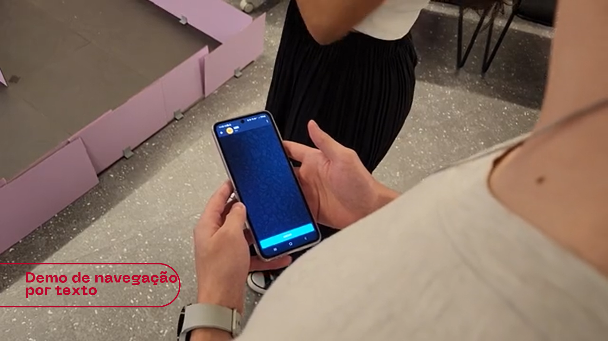
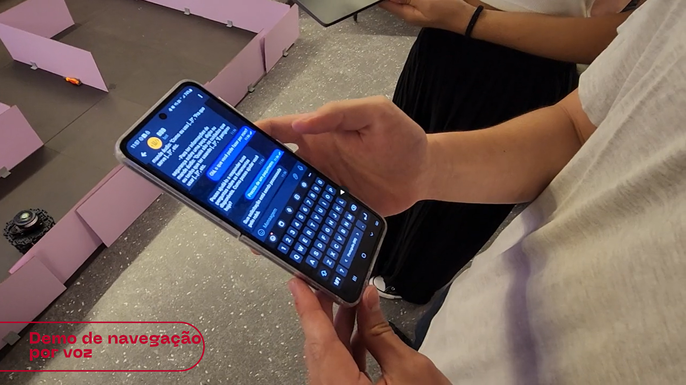
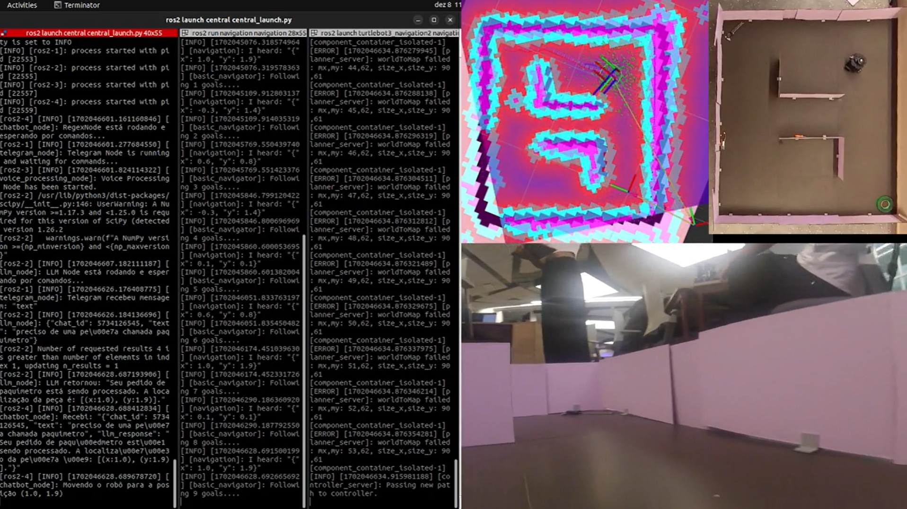

# Demonstração de funcionalidades desenvolvidas

O objetivo desta etapa da documentação é elencar as funcionalidas que foram desenvolvidas até a sprint 4, explicitando o que o sistema é ou não capaz de fazer. 

## Demonstração de navegação até peça desejada com interação de texto via Chatbot Telegram

O vídeo abaixo mostra a interação do usuário com o chatbot via texto, onde o usuário informa a ação e o nome da peça que deseja e o LLM retorna suas coordenadas, que são processadas com regex e publicadas para o Nó de navegação, responsável por conduzir o robô até a peça desejada.

## Demonstração de navegação até peça desejada com interação de voz via Chatbot Telegram

O vídeo abaixo mostra a interação do usuário com o chatbot via voz, onde o usuário verbaliza a ação e o nome da peça que deseja, sendo esse áudio transmitido para um script STT que o decodifica para formato de texto. Esse texto, por sua vez, alimenta o LLM, que retorna as coordenadas da peça requisitada, que são processadas com regex e publicadas para o Nó de navegação, responsável por conduzir o robô até a peça desejada.

## Demonstração da execução dos Nós ROS de chatbot, navegação, reconhecimento de voz e geração de voz e mapeamento de ambiente

O vídeo abaico mostra a execução dos nós ROS que compõem o sistema, sendo eles: chatbot, navegação, reconhecimento de voz e geração de voz, bem como o mapeamento de ambiente. 

## Balanço de funcionalidades

As funcionalidades implementadas foram organizadas em uma tabela onde é possível verificar o que o sistema é capaz de fazer e o que ele ainda não faz.

| **Funcionalidade** | **Faz** | **Não faz** |
| :---         |     :---:      |       :---:  |
| O usúario consegue interagir com a LLM por meio de mensagem de voz |    ✅ 	    |      |
| O robô é capaz de trazer a peça para o usúario     |        | ❌     |
| O robô recebe os comandos de buscar uma peça atráves do telegram      | ✅       |      |
| Existe um dashboard de quantas peças estão disponíveis     |        | ❌     |
| É possível se comunicar com o robô por outros meios além do telegram     |        | ❌     |
| A LLM é capaz de lidar com múltiplas requisições por minuto     |        | ❌     |
| O administrador tem um banco de dados com todas peças disponíveis    |       | ❌     |
| É possível criar relatórios customizados com base nas requisições feitas     |        | ❌     |
| O sistema é capaz de receber um documento com todas localizações de peças     | ✅       |      |
| O robô é capaz de responder perguntas sobre os mais variados assuntos    |        | ❌     |
| O robô é capaz de explicar como usar determinada ferramenta    | ✅       |      |

Essas são algumas das principais funcionalidades desenvolvidas ao longo das semanas. Além disso, demandas em relação ao front-end e visualização de dados não puderam ser implementadas, visto a falta de tempo. Em versões mais completas do projeto tais pontos são primordiais para uma solução mais robusta.