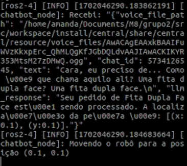
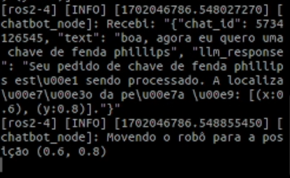

## Interface de interação com o chatbot

Na terceira sprint do projeto, espera-se que o sistema de autoatendimento via chatbot seja refinado em diferentes aspectos. Primeiramente, é esperada a finalização do pacote referente à interpretação de intenções do usuário por meio de expressões regulares. Desse modo, será possível estabelecer a ponte de comunicação entre o comando enviado e o nodo de navegação do robô. Além disso, espera-se, no chatbot, implementar um sistema speech-to-text (STT), a fim de que seja possível interagir com a aplicação por meio de áudio. O contrário também poderá acontecer: se o usuário desejar, poderá receber a resposta do chatbot por meio de áudio. Para isso, pretende-se desenvolver um script capaz de receber o texto de output do LLM, convertê-lo em áudio e reproduzi-lo para o usuário.

## Sistema Speech-to-Text

A interface STT da solução caracteriza-se pela transcrição do áudio enviado pelo usuário, se essa for a opção escolhida para interagir com o chatbot. O objetivo é que o áudio seja transcrito para texto e interpretado pelo Large Language Model utilizado, a fim de que uma resposta seja retornada.

A transcrição do áudio ocorrerá por meio do script denominado <code>voice_processing_node</code>, que caracteriza-se por um dos pacotes do nodo central da solução. Ao executá-lo em paralelo com o nodo de input correspondente ao Telegram, isto é, <code>telegram_node</code>, haverá transcrição de voz para texto caso o input identificado seja um arquivo de áudio. Primeiramente, o arquivo de áudio é salvo na memória e, posteriormente, transcrito para texto utilizando o Whisper, serviço de conversão de áudio escolhido.

## Testes do sistema Speech-to-Text

A fim de testar o sistema Speech-to-Text desenvolvido para a solução, foram realizados os seguintes procedimentos:

1. Execução do nó <code>voice_processing</code> em paralelo com os nós correspondentes ao Telegram e ao LLM.
2. Envio de um arquivo de áudio para o chatbot.
3. Verificação da transcrição do áudio para texto via terminal.

Abaixo, encontra-se um exemplo do sistema Speech-to-Text em funcionamento, já integrado ao ambiente ROS construído.

Frente às evidências apresentadas, foi possível validar o funcionamento do script, assim como o sucesso de uso da tecnologia Whisper. Na seção Funcionalidades Desenvolvidas, é possível conferir um vídeo demonstrativo em que o usuário interage com o chatbot por meio de áudio.