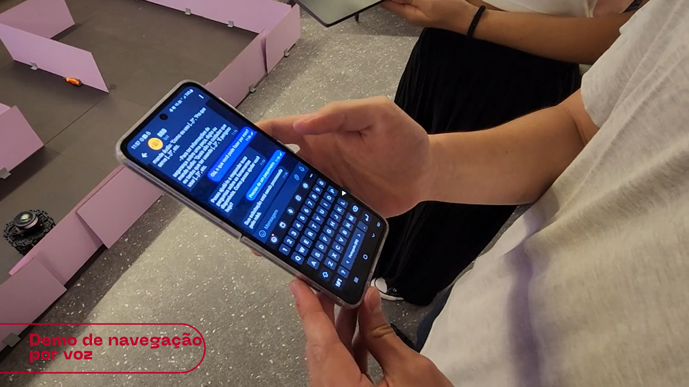

# Registro do teste de usabilidade

Com o objetivo de testar as principais funcionalidades da interação do usuário do sistema com a interface do Telegram para chatbot, foi realizado um teste de usabilidade com a colaboradora responsável pelo almoxarifado da Planta Guarulhos da Ambev. O teste foi realizado com o intuito de verificar a facilidade de uso do sistema, nível de assertividade de suas instruções, bem como familiaridade com a interface do Telegram e interações com chatbots.

## Registro do teste de Experiência do Usuário para Sistema Robótico de Localização de Itens em Almoxarifado do Grupo Bring Beers n’ Bots

### Informações do Participante
- #### Nome: (Retirado por questões de privacidade)
- #### Cargo/Função: Técnica de almoxarifado
- #### Anos de experiência em gerenciamento de almoxarifado: 10 anos

### Introdução:
Agradecemos por participar do nosso teste de UX para o sistema robótico para localização de itens em almoxarifado. Seu feedback é valioso para nós. Muito obrigado por doar seu tempo para nos ajudar. Este teste será conduzido via chamada no Hangouts.

### Entrevista pré-teste

Quão familiarizado você está com sistemas de chatbot?

R: Muito familiarizado 

Você já usou sistemas semelhantes anteriormente? Se sim, forneça uma breve descrição.

R: Usa o sistema de chatbot no WhatsApp da própria cervejaria;

### Fase de teste e observação

#### Instruções para o teste:
Seja vocal sobre seus pensamentos, sentimentos, opiniões e problemas encontrados. Esta não é uma avaliação do seu desempenho; estamos testando o sistema, que ainda está em desenvolvimento.

#### Tarefa
"Escolha um item da lista de itens simulados do almoxarifado e solicite esse item via chatbot
Demonstrar a utilização da interface do telegram, tanto por mensagem quanto por voz.
Demonstrar o robô se deslocando para determinado ponto."

#### Observações

- Ela viu muito ganho em utilizar o dashboard igual o desenvolvido por outro grupo. É importante para ela ter acesso rápido às informações das quais ela precisa no dia a dia. Deu para perceber que o dashboard sintetiza essas informações, o que agrega muito valor ao trabalho dela.

- A Ambev usa o Telegram para comunicações internas e um chatbot no WhatsApp.

- As solicitações que eles realizam são bem específicas no dia a dia.

- Input que ela colocaria caso quisesse solicitar um rolamento: “rolamento”, tendo dúvidas no início sobre qual comando escrever para obter o componente.

- O output recebido foi “Seu pedido de rolamento está sendo processado. A localização da peça é: (x:50)(y:350)”

- “Quais são as instruções de uso do rolamento?”

- Output: mensagem em que o chat pede desculpas por não saber responder.

- “Como eu uso uma chave de fenda?”
Output: retornou o propósito da chave de fenda com base no contexto do modelo de linguagem.

- No cenário de teste foi demonstrada a interface do Telegram e foi perguntado ao usuário que mensagem o usuário mandaria para requisição da peça. O usuário optou por enviar o nome da peça “rolamento” . 

- As pessoas que estão entrando conseguem entender como utilizar a ferramenta, por isso gostou da interface. 

- Quanto ao Telegram, ela só precisa conferir internamente na companhia qual interface a Ambev vai optar por implementar. A interação com o robô é importante para esse aspecto de localização. Saber quantidades e histórico de requisições é importante também.

- É preciso saber quem é o requisitante, peça e datetime da requisição. Pode ser um csv

## Alteração de mensagem inicial com instruções de uso do chatbot

Uma vez que a usuária do chatbot apresentou uma resistência inicial sobre o que escrever para o chatbot a fim de cumprir a tarefa que lhe fora designada, foi inferido que o texto de instruções iniciais do chatbot deveria ser aprimorado.

A apresentação da nova introdução do chabot foi bem-recebida e elogiado pelo parceiro de mercado durante a apresentação da Sprint Review 4.

## Verificação de acessibilidade para tipos de daltonismo

Como uma das preocupações sobre a acessibilidade da interface escolhida para abrigar o chatbot, foi realizada uma verificação de acessibilidade para tipos de daltonismo. A verificação foi realizada com o auxílio do App Chroma Vision, capaz de simular diferentes tipos de daltonismo.

A partir das imagens acima geradas no teste realizado, é possível verificar que as cores de alto contrastes nativas da interface Telegram são suficientes para permitir sua distinção mesmo sob diferentes tipos de daltonismo.

### Acessibilidade para deficiências motoras moderadas

A possibilidade de interagir com o sistema de navegação via chatbot utilizando apenas uma das mãos e tendo a voz como meio de informar as instruções, faz com que o sistema seja adequado para o uso por pessoas com deficiências motoras moderadas. 

Abaixo está um vídeo com a demonstração desse recurso.

