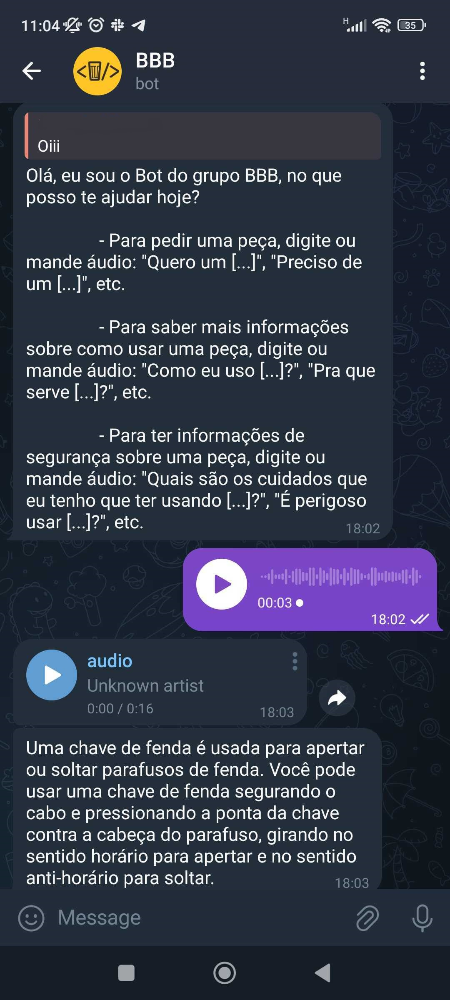

## Introdução 

A interface do usuário é primordial para que ocorra a interação com o sistema que foi desenvolvido ao longo das dez semanas. Assim, ao desenvolver uma interface é necessário ter em mente todo o fluxo de interação com a solução e desenvolver algo que seja comum e fácil de entender para o usuário. 

Assim, ao invés de criar uma interface do zero o grupo optou por utilizar algo que já foi validado por milhões de usuários. Então, como interface estamos utilizando o Telegram dado os motivos elencados.  

## Interface

Na imagem abaixo é possível ver como funciona a interação com o Telegram.

Algo muito interessante para se observar é o funcionamento do bot, onde logo após enviar qualquer mensagem o bot é ativado. Assim, há a resposta e é possível interagir com a IA por voz ou texto. 
Por fim, a IA responde a dúvida do usuário e logo em seguida o robô se movimenta para buscar a peça. 

## Detalhamento das etapas 

Caso deseje entender mais sobre como foi feito o desenvolvimento da interface é válido olhar os seguintes links. 

[Frontend](https://2023m8t2-inteli.github.io/grupo2/sprint2/Frontend/) 
