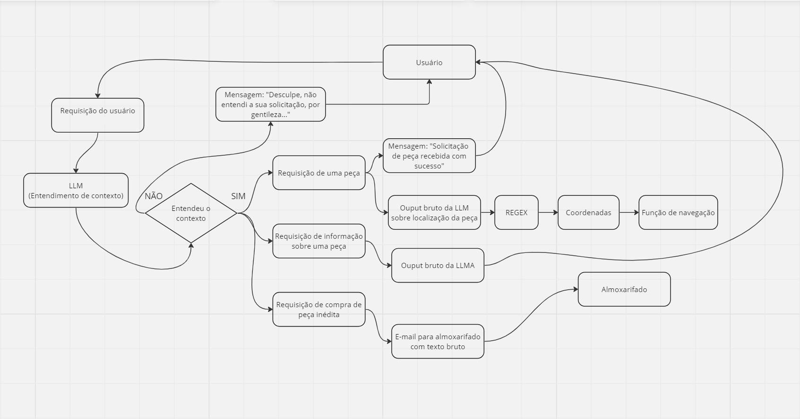

## Introdução 

O chatbot é onde ocorre toda interação do usuário com a LLM. É a partir de uma interação do usuário com o bot no Telegram que é possível decidir se o robô irá pegar uma peça, explicar sobre o funcionamento da mesma ou simplesmente não ocorre nenhuma interação. 

Durante o desenvolvimento da solução o grupo optou por desenvolver o sistema de chatbot tendo em mente a interação com o sistema apartir do Telegram. O motivo do Telegram é que além da API para integração ser totalmente gratuita. Após uma pesquisa de campo com funcionários do almoxerifado da Ambev os mesmos já estavam habituados a utilizarem bots no Telegram. Assim, além do bônus financeiro o usuário final já tem conhecimento com a solução utilizada.

## Funcionamento do chatbot

No diagrama abaixo é possível entender com detalhes como funciona todo o processo de interações e respostas do chatbot.

Após o usuário entrar na conversa com o bot é possível fazer uma requisição tanto por texto ou por voz. Caso, o que esteja sido pedido pelo usuário esteja na lista de peças disponíveis ( <code>src/workspace/src/central/resource/data.txt</code>).

Se a peça que o usuário fez a requisição está disponível o robô já vai em direção peça e leva o almoxerife.

## Detalhamento das etapas 

Caso deseje entender mais como funciona cada processo específico do chatbot é válido olhar os seguintes pontos que são cruciais para o entendimento completo do projeto. 

[Sistema de navegação](https://2023m8t2-inteli.github.io/grupo2/sprint3/Sistema%20de%20navega%C3%A7%C3%A3o/)

[Speech to Text](https://2023m8t2-inteli.github.io/grupo2/sprint4/Speech-to-Text/)

[Text to Speech](https://2023m8t2-inteli.github.io/grupo2/sprint4/Text-to-Speech/)

[Large Language Model](https://2023m8t2-inteli.github.io/grupo2/sprint3/LLM/)

[Frontend](https://2023m8t2-inteli.github.io/grupo2/sprint2/Frontend/) 
