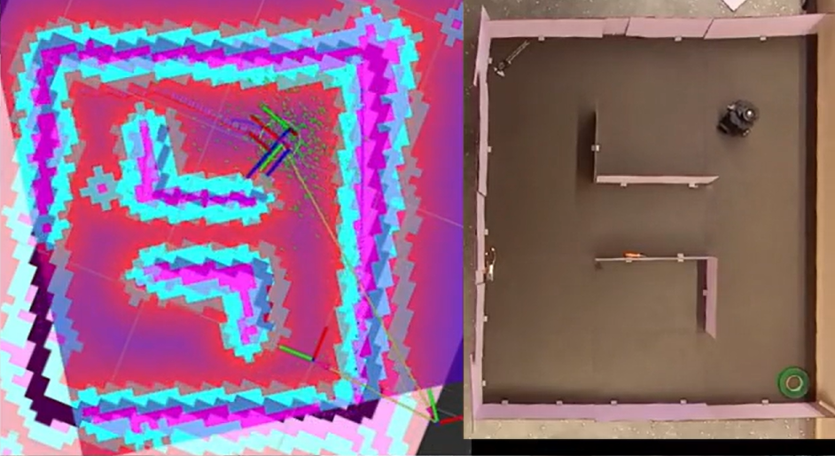

# Sistema de cartografia

Um dos principais pontos do projeto foi a tecnologias avançadas de navegação robótica, centrando-se em conceitos fundamentais para sistemas cartográficos, como SLAM (Simultaneous Localization and Mapping), LIDAR (Light Detection and Ranging) e NAV 2 (Navigation Stack 2).

O SLAM desempenhou um papel importante ao permitir que o robô TurtleBot 3 mapeasse dinamicamente o ambiente simulado do almoxarifado da Ambev. Ao utiliza o LIDAR, o TurtleBot 3 foi capaz de realizar varreduras precisas do ambiente, capturando informações sobre a disposição espacial e as características físicas do almoxarifado simulado. Esses dados foram então processados em tempo real, permitindo a criação de um mapa detalhado e atualizado do ambiente.

O LIDAR, em particular, desempenhou um papel crucial nesse processo. Ao emitir pulsos de laser e medir o tempo que leva para esses pulsos retornarem após atingirem objetos no ambiente, o LIDAR fornece dados tridimensionais precisos. Esses dados foram essenciais para a construção do mapa, pois permitiram a identificação de obstáculos, a determinação de distâncias e a criação de uma representação tridimensional do almoxarifado.

A integração do NAV 2, ou Navigation Stack 2, complementou o sistema ao oferecer uma pilha de navegação autônoma. Essa pilha incorpora algoritmos avançados que utilizam os dados do SLAM para que o robô TurtleBot 3 pudesse navegar de maneira autônoma no ambiente mapeado até os itens pedidos mediante a interface de chatbot de requisição de peças para o almoxarifado. Esses algoritmos levam em consideração as informações de localização do robô, as coordenadas espaciais do ambiente e a detecção de obstáculos pelo LIDAR, garantindo uma navegação precisa e segura.

Dentro desse contexto, o sistema cartográfico resultante não apenas ofereceu uma representação visual do ambiente, mas também permitiu que o robô se movimentasse de maneira inteligente, evitando obstáculos e alcançando destinos específicos de maneira autônoma.

Em resumo, a sinergia entre SLAM, LIDAR e NAV 2 demonstra um avanço significativo na capacidade de mapeamento e navegação em ambientes dinâmicos. Essas tecnologias não apenas oferecem soluções práticas para a logística e automação industrial, mas também abrem possibilidades para o desenvolvimento de sistemas cartográficos cada vez mais sofisticados e autônomos. O projeto destaca a importância dessas inovações no contexto da robótica móvel e aponta para um futuro em que a navegação autônoma e o mapeamento em tempo real se tornarão padrões em diversas aplicações industriais e de serviços.